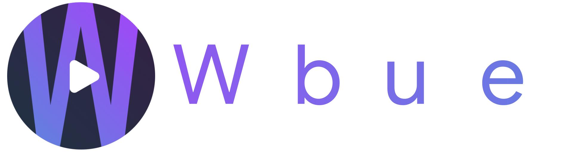

  <a href="https://webtubeapp.xyz/">
    
 WebTube is an application based on the YouTube website with many customizations and modifications.
</a>
   
  

 Table of contents 

 1. [Features](#Features)
 2. [Plug-in](#Plug-in)
 3. [Upcoming](#Upcoming)
 4. [Contributing](#Contributing)
 5. [Contributors](#Contributor)
 6. [Disclaimer](#Disclaimer)
 

# Features
<picture>
  <source media="(prefers-color-scheme: dark)" srcset="https://cdn.discordapp.com/attachments/1020352646630084608/1020899350542557246/adblock-dark.svg" width="350" height="60">
  <source media="(prefers-color-scheme: light)" srcset="https://cdn.discordapp.com/attachments/1020352646630084608/1020898934194974770/adblock-light.svg" width="350" height="60">
  
</picture>

<picture>
  <source media="(prefers-color-scheme: dark)" srcset="https://cdn.discordapp.com/attachments/1020352646630084608/1020900619789275218/plugin-dark.svg" width="350" height="60">
  <source media="(prefers-color-scheme: light)" srcset="https://cdn.discordapp.com/attachments/1020352646630084608/1020900785506230272/plugin-light.svg" width="350" height="60">
  
</picture>

<picture>
  <source media="(prefers-color-scheme: dark)" srcset="https://cdn.discordapp.com/attachments/1020352646630084608/1020900939693043852/lightweight-dark.svg" width="350" height="60">
  <source media="(prefers-color-scheme: light)" srcset="https://cdn.discordapp.com/attachments/1020352646630084608/1020900852728344607/lightweight-light.svg" width="350" height="60">
  
</picture>

# Plug-in
>Userscript to customize Youtube Web Experience.

Click me to see list of available plug-in.

- Adguard: Block all Youtube ads
- AgeBypasser: Bypass age restriction
- AntiClickBait: Preview content without actually clicking on it
- SponsorBlock: Skip unwanted segments
- RYD: Display youtube dislikes
- Short Disabler: Disable short button
- WebTube anonymous statistics: Obtain statistics on the use of the application in an anonymous way

# Upcoming
- Picture in Picture mode
- Redesigned settings page
- And much more...

# Contributing
If you want to contribute or translate the app, please read documentation [here](contributing.md)
(Note: Document is not finished yet)

# Contributors
<h3>List of contributors contributed to this project:</h3>

### Made with [contrib.rocks](https://contrib.rocks)

# Disclaimer
YouTube is owned by Google LLC. WebTube is not affiliated in any way with Google/YouTube.

Thanks for supporting us ❤️
